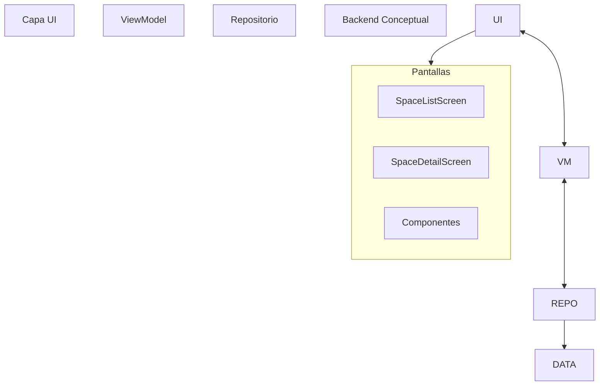

\# Arquitectura Simplificada

```mermaid

flowchart TD

UI\[Capa UI]

VM\[ViewModel]

REPO\[Repositorio]

DATA\[Backend Conceptual]


UI <--> VM

VM <--> REPO

REPO --> DATA


subgraph Pantallas

A\[SpaceListScreen]

B\[SpaceDetailScreen]

C\[Componentes]

end


UI --> Pantallas

```

